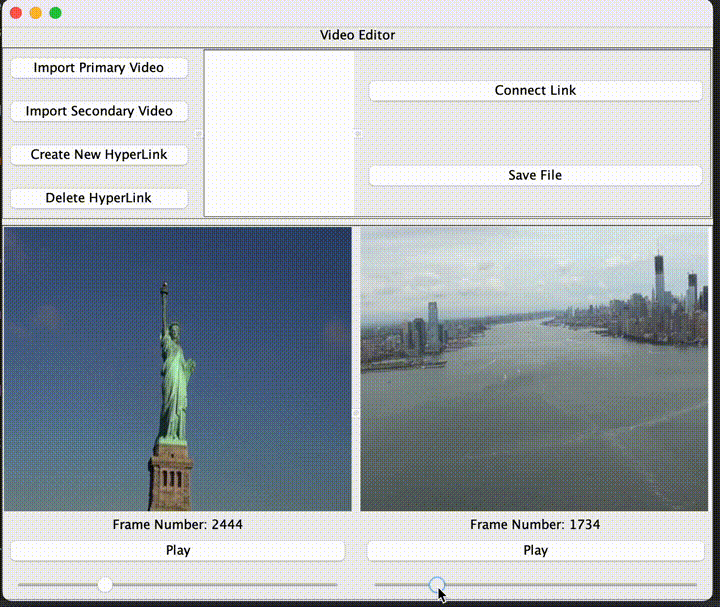
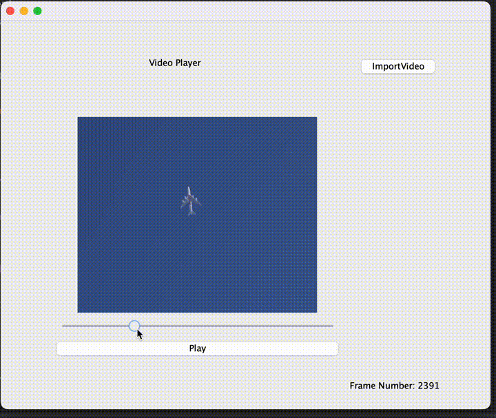

# HyperVideo
Video, but with hyperlinks! (**Multimedia System Design** team project)

## Idea
The idea of HyperVideo is adding non-linear playback functionality to normal video, by using hyperlinks inside video.

- Java project using Swing GUI
- Custom HyperVideo metadata file
- Audio/Video sync while playing and following links

## HyperVideo Editor

- Import primary and secondary video
- create hyperlink on secondary video at specified frame No. 
- assign spatiotemporal area on primary video to hyperlink
  - draw first bounding box at first appearance
  - draw last bounding box at last appearance
  - bounding boxes in between will be interpolated automatically

## HyperVideo Player

1. click on the bounding boxes (hyperlinks) when playing video
2. target video at target frame will start playing

# Source Code
Full source code is available upon request. Due to policy restrictions no public repository is availble.
